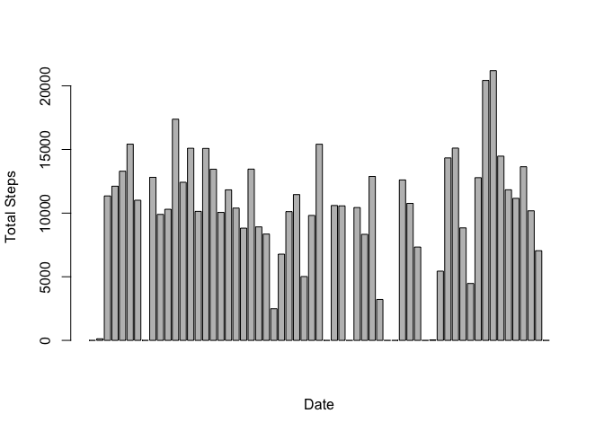
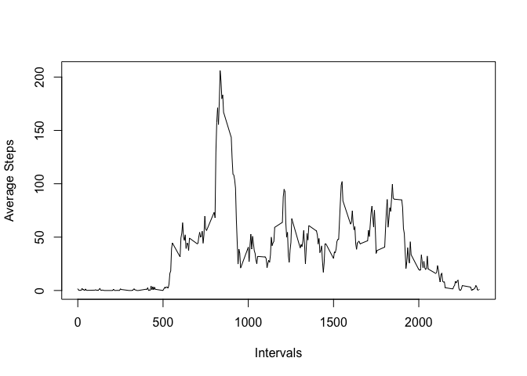
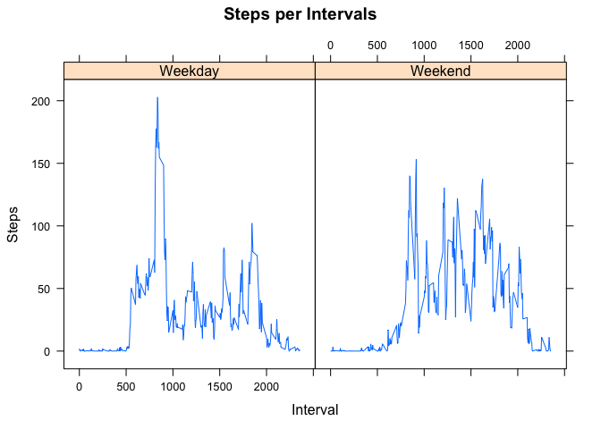

# Reproducible Research: Peer Assessment 1

```r
  library(knitr)
  opts_knit$set(root.dir=normalizePath('./'))
  opts_chunk$set(fig.path = "./figures/") # corrected path
```

## Loading and preprocessing the data

```r
getData <- function() {
        partData <- read.table("./activity.csv", sep = ",", header = TRUE)
        #Add the date column
        partData$date <- as.Date(partData$date, format="%Y-%m-%d")
        #Add the day column
        partData$day <- weekdays(partData$date)
        #add the weekday column
        partData$weekday <- apply(partData, 1, function(d) {   
                if(d["day"] == "Sunday" || d["day"] == "Saturday") {
                        factor("Weekend")
                }
                else {
                        factor("Weekday")  
                }
        })
        partData
}
```

## What is mean total number of steps taken per day?

```r
totalNumberStepsPerDay <- function(data) {
        require("plyr")
        require("ggplot2")
        d <- ddply(data, c("date"),  function(d) {
                c(sum(d$steps, na.rm=TRUE))})
        names(d)[2] <- "sum"
        barplot(d$sum, xlab="Date", ylab="Total Steps" )
}
```

The following barchart shows the total number of steps taken per day

```
## Loading required package: plyr
## Loading required package: ggplot2
```

 

## What is the mean and median of the number of steps taken per day

```r
reportMeanAndMedian <- function(data) {
        require("plyr")
        d1 <- ddply(data, c("date"),  function(d) {
                c(mean(d$steps, na.rm=TRUE))})
        d2 <- ddply(data, c("date"),  function(d) {
                c(median(d$steps, na.rm=TRUE))})
        d1 <- cbind(d1, d2$V1)
        names(d1)[2] <- "mean"
        names(d1)[3] <- "median"
        d1
}
```

The following table shows the mean and median of number of steps taken per day

```
##          date       mean median
## 1  2012-10-01        NaN     NA
## 2  2012-10-02  0.4375000      0
## 3  2012-10-03 39.4166667      0
## 4  2012-10-04 42.0694444      0
## 5  2012-10-05 46.1597222      0
## 6  2012-10-06 53.5416667      0
## 7  2012-10-07 38.2465278      0
## 8  2012-10-08        NaN     NA
## 9  2012-10-09 44.4826389      0
## 10 2012-10-10 34.3750000      0
## 11 2012-10-11 35.7777778      0
## 12 2012-10-12 60.3541667      0
## 13 2012-10-13 43.1458333      0
## 14 2012-10-14 52.4236111      0
## 15 2012-10-15 35.2048611      0
## 16 2012-10-16 52.3750000      0
## 17 2012-10-17 46.7083333      0
## 18 2012-10-18 34.9166667      0
## 19 2012-10-19 41.0729167      0
## 20 2012-10-20 36.0937500      0
## 21 2012-10-21 30.6284722      0
## 22 2012-10-22 46.7361111      0
## 23 2012-10-23 30.9652778      0
## 24 2012-10-24 29.0104167      0
## 25 2012-10-25  8.6527778      0
## 26 2012-10-26 23.5347222      0
## 27 2012-10-27 35.1354167      0
## 28 2012-10-28 39.7847222      0
## 29 2012-10-29 17.4236111      0
## 30 2012-10-30 34.0937500      0
## 31 2012-10-31 53.5208333      0
## 32 2012-11-01        NaN     NA
## 33 2012-11-02 36.8055556      0
## 34 2012-11-03 36.7048611      0
## 35 2012-11-04        NaN     NA
## 36 2012-11-05 36.2465278      0
## 37 2012-11-06 28.9375000      0
## 38 2012-11-07 44.7326389      0
## 39 2012-11-08 11.1770833      0
## 40 2012-11-09        NaN     NA
## 41 2012-11-10        NaN     NA
## 42 2012-11-11 43.7777778      0
## 43 2012-11-12 37.3784722      0
## 44 2012-11-13 25.4722222      0
## 45 2012-11-14        NaN     NA
## 46 2012-11-15  0.1423611      0
## 47 2012-11-16 18.8923611      0
## 48 2012-11-17 49.7881944      0
## 49 2012-11-18 52.4652778      0
## 50 2012-11-19 30.6979167      0
## 51 2012-11-20 15.5277778      0
## 52 2012-11-21 44.3993056      0
## 53 2012-11-22 70.9270833      0
## 54 2012-11-23 73.5902778      0
## 55 2012-11-24 50.2708333      0
## 56 2012-11-25 41.0902778      0
## 57 2012-11-26 38.7569444      0
## 58 2012-11-27 47.3819444      0
## 59 2012-11-28 35.3576389      0
## 60 2012-11-29 24.4687500      0
## 61 2012-11-30        NaN     NA
```

## What is the average daily activity pattern?

```r
averageDailyActivity <- function(data) {
        require("plyr")
        d <- ddply(data, c("interval"),  function(d) {
                c(mean(d$steps, na.rm=TRUE))})
        names(d)[2] <- "mean"
        plot(d$interval, d$mean, type="l", xlab="Intervals", ylab="Average Steps")
        print(paste("Interval with maximum average steps:",
                    d[which.max(d$mean), ]$interval))
}
```

The following chart shows the average number of steps taken per interval throughout a typical day
 

```
## [1] "Interval with maximum average steps: 835"
```

## Inputing missing values

```r
inputMissingValues <- function(data) {
        #replace all the NAs with zero
        data[is.na(data)] <- 0
        data
}
```

## Are there differences in activity patterns between weekdays and weekends?

```r
plotWeekdayWeekend <- function(data) {
        require("plyr")
        require("lattice")
        
        dWeekday <- subset(data, data$weekday == "Weekday")
        dWeekend <- subset(data, data$weekday == "Weekend")

        d1 <- ddply(dWeekday, c("interval"),  function(d) {
                c(mean(d$steps, na.rm=TRUE))})
        d1$weekday <- factor("Weekday")
        
        d2 <- ddply(dWeekend, c("interval"),  function(d) {
                c(mean(d$steps, na.rm=TRUE))})
        d2$weekday <- factor("Weekend")
        
        plotData <- rbind(d1, d2)
        
        xyplot(plotData$V1~plotData$interval|plotData$weekday, 
                    main="Steps per Intervals", ylab="Steps",
                    xlab="Interval", type="l")
}
```

The following comparative charts show the difference in number of steps on a weekday vs. weekend

```
## Loading required package: lattice
```

 
